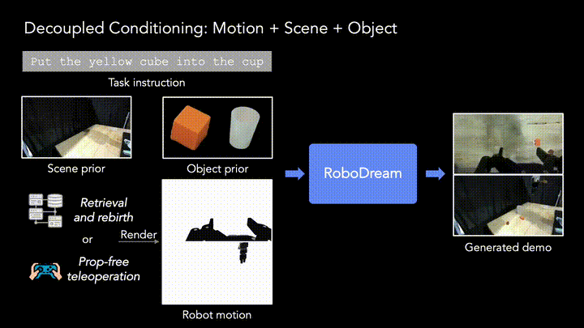

<div align="center">


# RoboDream: Compositional World Models for Scalable Robot Data Synthesis

[](https://arxiv.org/abs/2606.02577)
[](http://junjieye.com/RoboDream/)
[](LICENSE)

**[Junjie Ye](https://jay-ye.github.io/)<sup>1,2</sup>, [Rong Xue](https://rongxuezoe.github.io/)<sup>1</sup>, [Basile Van Hoorick](https://basile.be/)<sup>2</sup>, [Runhao Li](https://www.linkedin.com/in/runhao-li-lee021004/)<sup>1</sup>, [Harshitha Rajaprakash](https://harshithabr.github.io/)<sup>1</sup>, [Pavel Tokmakov](https://pvtokmakov.github.io/home/)<sup>2</sup>, [Muhammad Zubair Irshad](https://zubairirshad.com/)<sup>2</sup>, [Vitor Guizilini](https://vitorguizilini.github.io/)<sup>2,&dagger;</sup>, [Yue Wang](https://yuewang.xyz/)<sup>1,&dagger;</sup>**

<sup>1</sup>USC Physical Superintelligence (PSI) Lab &nbsp;&nbsp; <sup>2</sup>Toyota Research Institute &nbsp;&nbsp; <sup>&dagger;</sup>Equal advising



</div>

## Abstract

RoboDream is a generalizable embodiment-centric world model for scalable robot data synthesis. It anchors generation to rendered robot motion while conditioning on explicit scene and object priors, decoupling trajectory execution from environment synthesis to produce photorealistic demonstrations with novel objects, scenes, and viewpoints. This enables *retrieval and rebirth* (repurposing existing trajectories into new contexts) and *prop-free teleoperation* (operators manipulate empty air while the model hallucinates objects and scene). Real-world experiments show the generated data consistently improves downstream policy performance and substantially reduces real-world data requirements.

## Code Release

🚧 **Code coming soon.** We are cleaning up the codebase and will release training, data generation, and policy-learning pipelines here.

## Citation

If you find RoboDream useful in your research, please consider citing:

```bibtex
@article{ye2026robodream,
  title={RoboDream: Compositional World Models for Scalable Robot Data Synthesis},
  author={Ye, Junjie and Xue, Rong and Van Hoorick, Basile and Li, Runhao and Rajaprakash, Harshitha and Tokmakov, Pavel and Irshad, Muhammad Zubair and Guizilini, Vitor and Wang, Yue},
  journal={arXiv preprint arXiv:2606.02577},
  year={2026}
}
```

## License

This project is released under the [Apache License 2.0](LICENSE).
